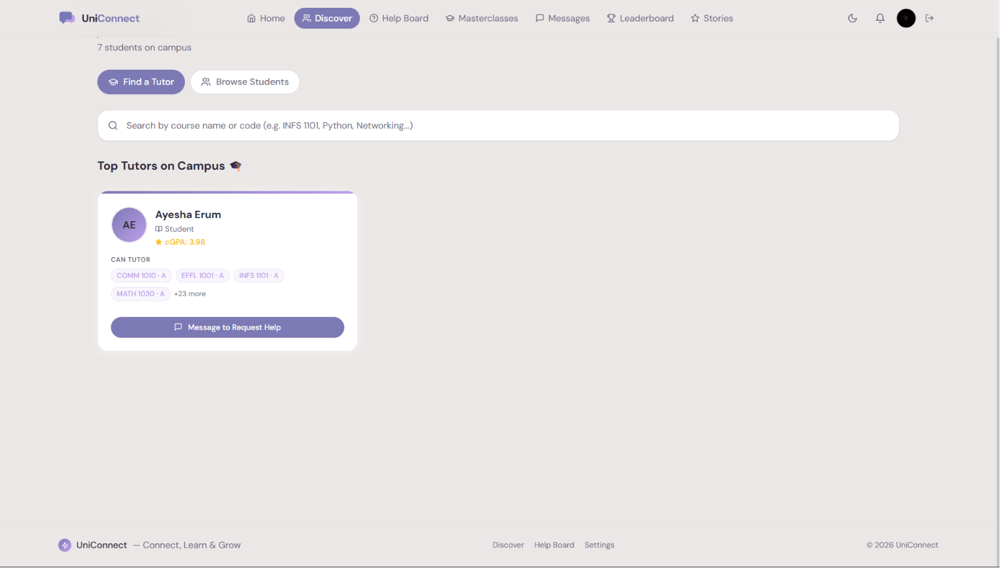

# UniConnect

> **Connect, Learn & Grow with fellow students on campus.**

UniConnect is a university-specific peer networking and tutoring platform where students share skills, discover tutors by course, join live Masterclasses, get quick help, and build their campus network.

🌐 **Live App**: [https://uniconnect-67fb6.web.app](https://uniconnect-67fb6.web.app)

---

## Screenshots

> _Visit the live app to explore all features_

| Dashboard | Tutor Discovery | Masterclasses |
|---|---|---|
|  |  |  |

---

## Features

| Feature | Description |
|---|---|
| **Authentication** | Email/password & Google OAuth sign-in |
| **Student Profiles** | Skills, bio, availability, photo upload |
| **Transcript Upload** | PDF parsing auto-extracts courses, letter grades & cGPA |
| **Tutor Discovery** | Search tutors by course code or name; filtered by grade B+ |
| **Direct Messaging** | Message any student directly — no connection required |
| **Help Board** | Q&A with upvotes, replies, tags & resolution status |
| **Masterclasses** | Join live peer-led Google Meet sessions |
| **Leaderboard** | Top helpers ranked by upvotes + badges |
| **Success Stories** | Community wins wall with likes |
| **Notifications** | Bell icon for messages, replies & activity |
| **Firebase Analytics** | Page view + custom event tracking |
| **Dark / Light mode** | Persisted across sessions |

---

## Tech Stack


- **Frontend**: React 18 + Vite 5
- **Styling**: Tailwind CSS v3 (custom warm lavender + purple palette)
- **Fonts**: DM Sans via Google Fonts
- **Auth**: Firebase Authentication (Email + Google OAuth)
- **Database**: Cloud Firestore (real-time listeners)
- **Storage**: Firebase Storage (profile photos)
- **Hosting**: Firebase Hosting (auto-deploy via GitHub Actions)
- **Analytics**: Firebase Analytics (page views + custom events)
- **State**: React Context API (Auth + Theme)
- **Notifications**: react-hot-toast
- **Icons**: lucide-react
- **PDF Parsing**: pdfjs-dist (transcript extraction)

---

## Live Demo

Visit the live app at **[https://uniconnect-67fb6.web.app](https://uniconnect-67fb6.web.app)**

To test the full tutor discovery feature:
1. Sign up with any email
2. Go to your Profile → upload your university transcript PDF
3. Courses are auto-extracted and you appear in Discover as a tutor
4. Go to **Discover → Find a Tutor** → search `INFS` or `DACS` to find tutors

---

## How Tutor Discovery Works

1. Student uploads their university transcript PDF on their profile page
2. The app automatically extracts course codes, titles, letter grades, and cumulative GPA
3. Students with grade **B or above** in a course appear as available tutors for that course
4. Other students search by course code (e.g. `INFS 1101`) or name (e.g. `Networking`)
5. Click **"Message to Request Help"** to open a direct chat — no connection needed first

---

## How Masterclasses Work

Any student can create a live session:
1. Go to **Masterclasses** → click **+ Add Class**
2. Fill in title, topic, description, Google Meet link, and scheduled time
3. The session appears on the Masterclasses board for all students
4. Students click **"Join Class"** to open the Google Meet link directly

---

## Quick Start

### 1. Clone the repo

```bash
git clone https://github.com/AyeshaErum/UniConnect.git
cd UniConnect
```

### 2. Install dependencies

```bash
npm install
```

### 3. Configure Firebase

Create a `.env` file in the project root:

```bash
cp .env.example .env
```

Fill in your Firebase project values:

```env
VITE_FIREBASE_API_KEY=your_api_key
VITE_FIREBASE_AUTH_DOMAIN=your_project.firebaseapp.com
VITE_FIREBASE_PROJECT_ID=your_project_id
VITE_FIREBASE_STORAGE_BUCKET=your_project.appspot.com
VITE_FIREBASE_MESSAGING_SENDER_ID=your_sender_id
VITE_FIREBASE_APP_ID=your_app_id
VITE_FIREBASE_MEASUREMENT_ID=G-XXXXXXXXXX
```

### 4. Start the dev server

```bash
npm run dev
```

Open [http://localhost:5173](http://localhost:5173) in your browser.

---

## Firebase Setup Guide

### Step 1 — Create a Firebase project

1. Go to [console.firebase.google.com](https://console.firebase.google.com)
2. Click **Add project** → name it (e.g. `uniconnect`)
3. Enable Google Analytics (recommended)

### Step 2 — Enable Authentication

1. Go to **Authentication → Get started**
2. Enable **Email/Password** provider
3. Enable **Google** provider (add your support email)

### Step 3 — Create Firestore Database

1. Go to **Firestore Database → Create database**
2. Choose **Start in production mode**
3. Select your nearest region
4. Deploy rules: `firebase deploy --only firestore:rules`

### Step 4 — Enable Storage

1. Go to **Storage → Get started**
2. Accept the default rules

> ⚠️ **Note**: Firebase Storage requires the **Blaze (pay-as-you-go)** plan for projects created after September 2024. Profile photo uploads use Storage. The rest of the app (auth, Firestore, hosting) works on the free Spark plan.

### Step 5 — Register your web app

1. Go to **Project Settings → Add app → Web**
2. Register the app and copy the config values to your `.env`

### Step 6 — Deploy Firestore indexes

```bash
firebase deploy --only firestore:indexes
```

---

## Environment Variables

| Variable | Description |
|---|---|
| `VITE_FIREBASE_API_KEY` | Firebase Web API key |
| `VITE_FIREBASE_AUTH_DOMAIN` | Auth domain (project.firebaseapp.com) |
| `VITE_FIREBASE_PROJECT_ID` | Firestore project ID |
| `VITE_FIREBASE_STORAGE_BUCKET` | Storage bucket URL |
| `VITE_FIREBASE_MESSAGING_SENDER_ID` | Cloud Messaging sender ID |
| `VITE_FIREBASE_APP_ID` | Firebase App ID |
| `VITE_FIREBASE_MEASUREMENT_ID` | Google Analytics measurement ID |

> **Never commit your `.env` file** — it is already in `.gitignore`.

---

## Populate Demo Data

After signing in, click **"Seed Database"** on the Home dashboard to load sample students, tutors with transcript data, masterclasses, help posts, and stories.

---

## Build & Deploy

```bash
# Development server
npm run dev

# Production build
npm run build

# Preview build locally
npm run preview

# Deploy to Firebase Hosting manually
npm run deploy
```

This project is configured with **GitHub Actions** for automatic deployment:
- Every push to `main` → auto-deploys to the live site
- Every Pull Request → deploys a preview channel for review

---

## Analytics Tracked

The following events are tracked via Firebase Analytics:

| Event | Trigger |
|---|---|
| `page_view` | Every route navigation |
| `transcript_uploaded` | Student uploads a PDF transcript |
| `tutor_messaged` | Student clicks "Message to Request Help" |
| `masterclass_joined` | Student clicks "Join Class" |
| `help_post_created` | New Help Board post submitted |
| `profile_completed` | Student finishes profile setup |

View analytics at: **Firebase Console → Analytics → Dashboard**

---

## Project Structure

```
src/
├── components/
│   ├── layout/           Navbar, Footer
│   ├── ui/               Button, Card, Badge, Modal, Input, Avatar, SkeletonLoader
│   ├── profile/          ProfileCard, EditProfileForm, SkillTag
│   ├── helpboard/        HelpPost, ReplyForm, UpvoteButton
│   ├── masterclasses/    ClassCard, CreateClassModal
│   ├── discover/         TutorCard, CourseSearchBar
│   ├── messages/         ConversationList, ChatWindow, MessageBubble
│   └── notifications/    NotificationBell, NotificationItem
├── pages/                All page components
├── context/              AuthContext, ThemeContext
├── hooks/                useAuth, useFirestore, useRealtime
├── firebase/             config, auth, firestore, storage
└── utils/                helpers, constants, seedData, transcriptParser, analytics
```

---

## Firestore Collections

```
users/{userId}            Profile, skills, transcriptData, isTutor flag
helpPosts/{postId}        Help requests + nested replies subcollection
masterclasses/{classId}   Live session details + Google Meet link
messages/{convId}         Conversation participants + nested messages
notifications/{userId}    Per-user notification items subcollection
successStories/{storyId}  Community stories + likes array
```

---

## Contact & Feedback

Built by **Ayesha Erum** — University of Doha for Science & Technology

Have feedback or found a bug? Open an issue on GitHub or reach out via the app's messaging feature.

---

## License

[MIT](LICENSE) © 2026 UniConnect